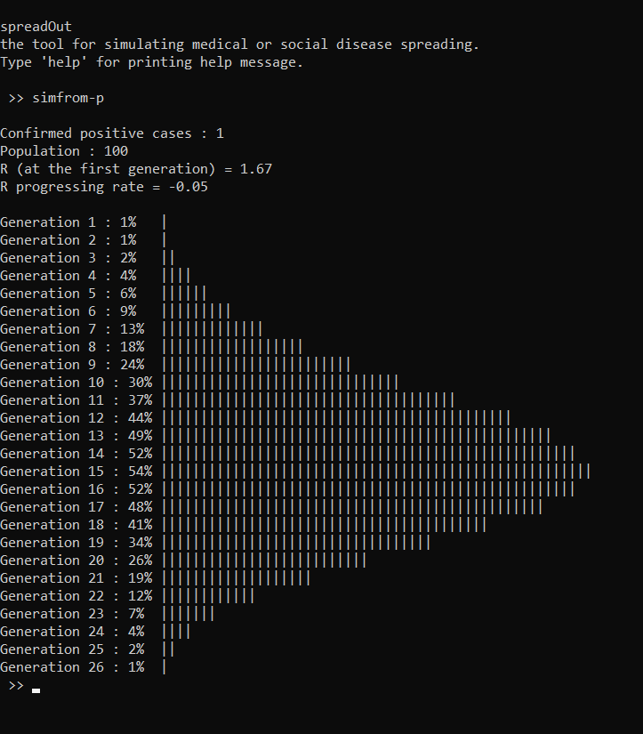

# spreadOut
spreadOut - the tool for simulating medical or social diseases spreading.

## What does it do ?

This small program can *"simulate"* how diseases spread themselves in a given population.

## How to use ?

First, build and run the file `main.cpp`. 

Then, type help to see all the possible commands.

## Bugs to be fixed

Let's face it, this program has many bugs.

But one main problem to this program is that it cannot show accurately the date, since the graphics are shown in ASCII.

    Until this problem isn't fixed, this tool can't be used for actual purpose (for showing *unaccurate* data)
 
 

## Example

# Feel free to contribute 😉
